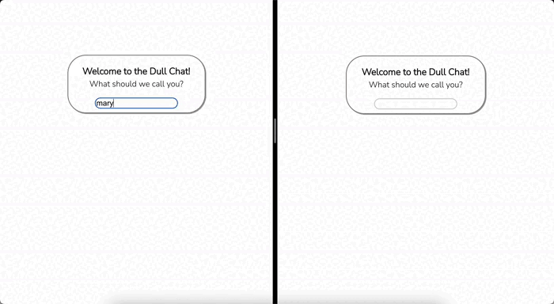

# Live Chat Server + Client

A Chat Server + Client application that uses GraphQL subscriptions for live update.

## Tech Stack
 - **Server**: NodeJS + GraphQL Yoga
 - **Client**: React + GraphQL + Apollo Client

## Preview



## Installation

Use [yarn](https://yarnpkg.com/) to install and run both the server and the client.

```bash
yarn install
```
## Run

```bash
cd server
yarn server
```

```bash
cd client
yarn start
```